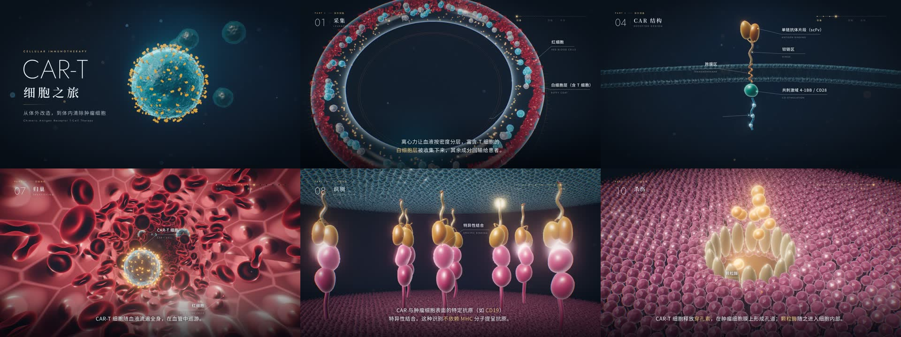

# CAR-T 细胞之旅

一部约 3 分钟的 CAR-T 细胞疗法科普动画：从患者血液中采集 T 细胞，经基因改造、体外扩增、静脉回输，到在体内识别并清除肿瘤细胞。



动画用 Three.js 实时渲染（WebGL 2），带电影级后期（HDR 泛光、ACES 色调映射、暗角、胶片颗粒）、中英双语标注、分章节字幕，以及与画面同步的生成式配乐。

## 观看

- **网页版**：用浏览器直接打开 `dist/index.html`（单文件，离线可用，已内嵌 three.js 与字体）。推荐最新版 Chrome / Edge / Safari / Firefox，横屏或全屏观看。
  - 空格：播放 / 暂停　←/→：快退 / 快进 5 秒　M：静音　F：全屏
  - 进度条按章节分段，可点击跳转。
- **视频版**（1080p30，时长 2:55）：
  - `video/cart-t-1080p.mp4`：H.264 + AAC，64 MB，兼容性最好，各平台上传、各种设备播放都没问题。
  - `video/cart-t-1080p-hevc.mp4`：H.265 + AAC，29 MB，画质相近、体积减半；部分 Windows 电脑需安装 HEVC 扩展才能本地播放。
  - 也可以用下文的脚本自行导出。

## 章节

| 时间 | 章节 | 内容 |
| --- | --- | --- |
| 0:00 | 片头 | CAR-T 细胞之旅 |
| 0:09 | 01 采集 | 白细胞单采：离心分层，收集富含 T 细胞的白细胞层 |
| 0:22 | 02 激活 | 抗 CD3/CD28 磁珠唤醒 T 细胞 |
| 0:33 | 03 基因转导 | 慢病毒载体进入细胞 → 逆转录 → CAR 基因整合进基因组 |
| 0:53 | 04 CAR 结构 | scFv、铰链区、跨膜区、共刺激域（4-1BB/CD28）、CD3ζ |
| 1:08 | 05 扩增 | 体外扩增至数亿个细胞，质检、冻存 |
| 1:20 | 06 回输 | 清淋化疗后，经静脉输注 |
| 1:33 | 07 归巢 | 随血流巡游，穿过血管内皮进入肿瘤组织 |
| 1:49 | 08 识别 | CAR 与肿瘤抗原（如 CD19）特异性结合，不依赖 MHC |
| 2:01 | 09 免疫突触 | 信号放大、细胞毒性颗粒极化、细胞因子释放 |
| 2:11 | 10 杀伤 | 穿孔素成孔、颗粒酶进入，肿瘤细胞凋亡 |
| 2:29 | 11 连续杀伤 | 一个 CAR-T 细胞接连杀伤多个目标并在体内扩增 |
| 2:41 | 12 长期守护 | 记忆性 CAR-T 细胞长期存留 |

所有旁白文字集中在 `src/content.js`，场景内的标注写在对应的 `src/scenes/*.js` 中。

## 构建

```bash
npm install
npm run build          # → dist/index.html（单文件）和 dist/artifact.html（three.js 走 CDN 的页面片段）
```

修改了任何中文文字后，先运行 `npm run fonts` 重新按实际用字从 Google Fonts 下载子集字体（`assets/fonts/`），再构建。

## 预览与导出视频

需要本机有 Playwright 自带的 Chromium 和 `ffmpeg`（含 libx264）。

```bash
npm run preview -- 12 60 130            # 渲染指定秒数的静帧 → out/preview/
npm run preview -- --shot car 2 8       # 某个镜头内的相对时间
npm run preview -- --every 4            # 每 4 秒一帧并拼成总览图

npm run audio                           # 离线渲染配乐 → out/soundtrack.wav
npm run render                          # 逐帧渲染 1080p30 → out/frames/（可中断后续跑）
npm run encode                          # 两遍编码 H.264 + AAC（约 4 Mbps）→ out/cart-t-1080p.mp4
npm run encode -- --name publish --bitrate 2800k --preset slower --ab 128k   # 发布用压缩版
npm run encode -- --name master --crf 18                                     # 高码率母版
```

动画中所有运动都是时间的纯函数（`window.__seek(t)`），因此逐帧导出与实时播放完全一致。

## 目录

```
src/
  content.js        章节、字幕、片头片尾文字
  main.js           播放器与导出接口
  audio.js          生成式配乐与音效（WebAudio，实时/离线共用）
  engine/           渲染管线、时间轴、叠加层（字幕/标注/HUD）、镜头路径
  gfx/              着色器与模型：细胞膜、受体、红细胞、磷脂双分子层、血管、粒子等
  scenes/           各镜头
scripts/            构建、字体子集、预览、配乐、逐帧导出、编码
assets/fonts/       子集字体（Noto Sans SC、Noto Serif SC、Jost、IBM Plex Mono）
```

## 说明

本动画为科普示意：细胞与分子的比例、时间尺度均经艺术化处理，不构成医疗建议。CAR-T 治疗可能引起细胞因子释放综合征（CRS）、免疫效应细胞相关神经毒性综合征（ICANS）等不良反应，须在具备资质的医疗机构中进行。

第三方资源：three.js（MIT）、webgl-noise 单纯形噪声（MIT）、Noto Sans SC / Noto Serif SC / Jost / IBM Plex Mono 字体（SIL Open Font License）、播放器图标取自 Material Icons（Apache 2.0）。
